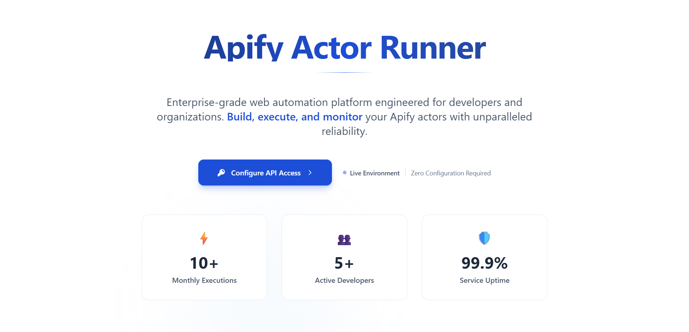
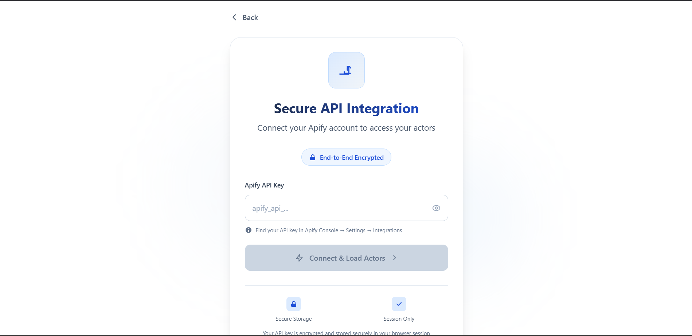
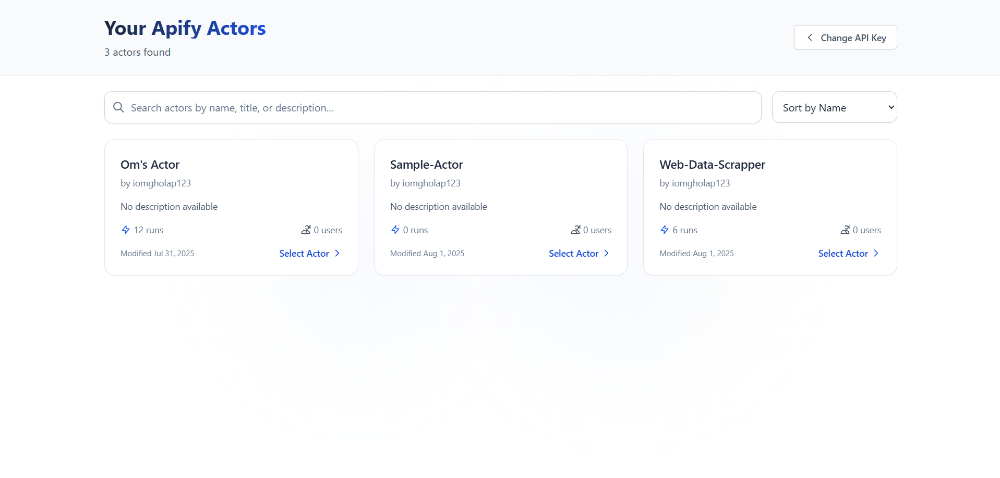
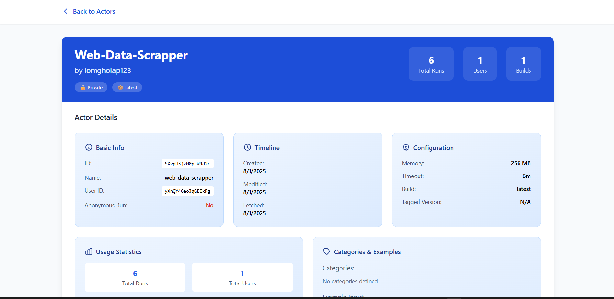
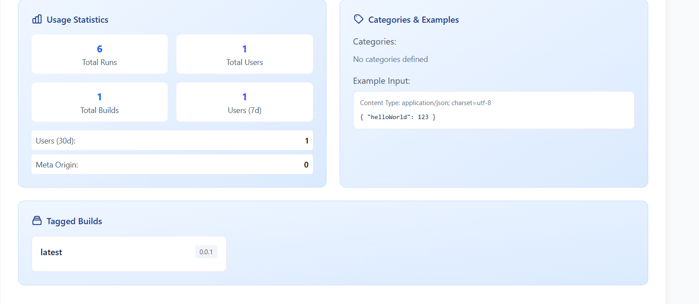
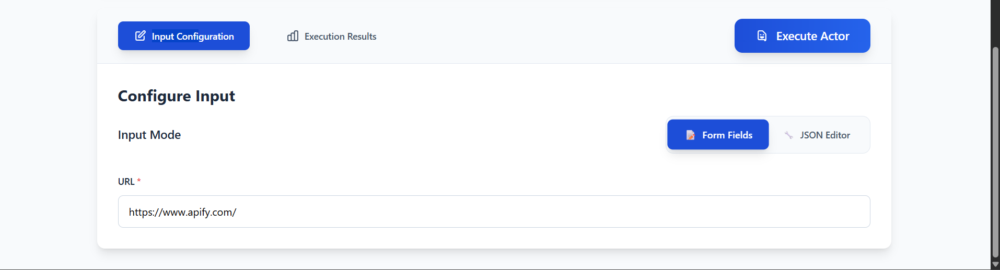
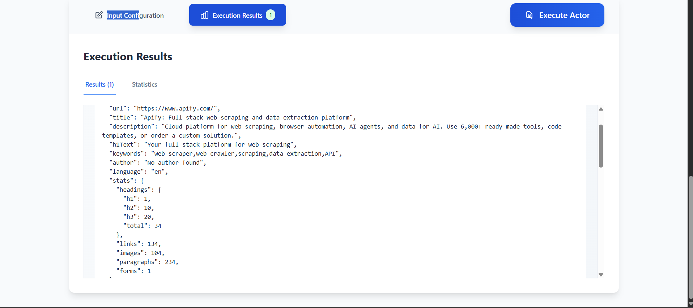
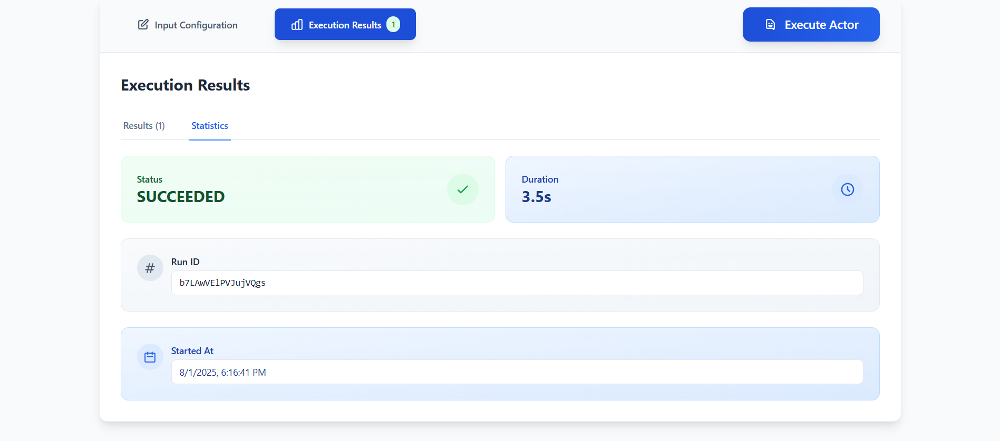

# Apify Actor Runner

A full-stack web application that allows users to interact with Apify actors through an intuitive interface. Users can browse available actors, configure inputs, execute them, and view results in real-time.

## 🎥 Watch Preview

[](https://youtu.be/XCOuDdZwsjk?si=_BalnZsWhbfosFAC)

*Click above to watch a complete walkthrough of the application in action*

## 🚀 Features

- **Actor Discovery**: Browse and search through available Apify actors
- **Detailed Actor Information**: View comprehensive actor details including stats, configuration, and documentation
- **Flexible Input Configuration**: Support for both form-based and JSON-based input methods
- **Real-time Execution**: Execute actors and monitor their progress
- **Results Visualization**: View execution results with statistics and detailed output
- **Responsive Design**: Modern, mobile-friendly UI with consistent blue theme
- **Dynamic Data Access**: Real-time fetching and display of actor information and execution results

## 🏗️ Architecture

### Frontend (React + Vite)
- **Framework**: React 19.1.0 with Vite for fast development
- **Routing**: React Router DOM for navigation
- **Styling**: Tailwind CSS with custom blue color palette
- **HTTP Client**: Axios for API communication
- **Real-time Updates**: Dynamic data fetching and live UI updates

### Backend (Node.js + Express)
- **Runtime**: Node.js with Express.js framework
- **API Integration**: Apify API client for actor operations
- **CORS**: Cross-origin resource sharing enabled
- **Environment**: Dotenv for configuration management

## 📦 Installation & Setup

### Prerequisites
- Git (for cloning the repository)
- Node.js (v16 or higher)
- npm or yarn package manager
- Apify API key ([Get one here](https://apify.com/account/integrations))

### Clone the Repository

1. Clone the project repository:
```bash
git clone https://github.com/omgholap11/Apify-Actor-Runner.git
```

2. Navigate to the project directory:
```bash
cd ApifyActorRunner
```

### Backend Setup

1. Navigate to the Backend directory:
```bash
cd Backend
```

2. Install dependencies:
```bash
npm install
```

3. Create a `.env` file:
```bash
# .env file (optional - API key is handled via frontend)
PORT=5000
```

4. Start the backend server:
```bash
# Development mode with auto-reload
npm run dev

# Production mode
npm start
```

The backend will run on `http://localhost:5000`

### Frontend Setup

1. Navigate to the Frontend directory:
```bash
cd Frontend
```

2. Install dependencies:
```bash
npm install
```

3. Start the development server:
```bash
npm run dev
```

The frontend will run on `http://localhost:5173`

## 🎯 How to Use

### Step 1: API Key Setup
1. Open the application in your browser
2. Enter your Apify API key on the homepage
3. The key is used to authenticate API requests

### Step 2: Browse Actors
1. Click "Get Started" to view available actors
2. Browse through the list of actors with their details
3. Use the search and filter functionality if needed

### Step 3: Configure Actor
1. Select an actor to view its detailed information
2. Review actor statistics, configuration, and documentation
3. Choose between Form Fields or JSON Editor for input configuration
4. Fill in the required parameters

### Step 4: Execute Actor
1. Click the "Execute Actor" button
2. Monitor the execution progress
3. View results in the "Execution Results" tab
4. Analyze statistics and output data

## 🧪 Testing Actors

We recommend testing with popular Apify actors. For this project, we have specifically tested with:

### Web Data Scraper
- **Purpose**: A custom web scraping actor that extracts website titles and basic content
- **What it does**: Visits a given URL and scrapes the page title along with other metadata
- **Test Input**: Simply provide a URL (e.g., "https://example.com")
- **Expected Output**: Returns the page title, URL, and basic page information

This actor demonstrates the core functionality of the application including input configuration, execution monitoring, and results display.

## 🔧 Technical Decisions & Assumptions

### Architecture Choices

1. **Separate Frontend/Backend**: 
   - Allows for better scalability and separation of concerns
   - Frontend can be deployed independently (CDN, static hosting)
   - Backend can handle API rate limiting and caching

2. **Dynamic Data Handling**:
   - Real-time fetching of actor information and schemas
   - Live updates during actor execution
   - Dynamic form generation based on actor input schemas

3. **React Router for Navigation**:
   - Enables proper browser history and deep linking
   - Better user experience with client-side routing
   - State preservation between routes

### UI/UX Decisions

1. **Consistent Blue Theme**:
   - Professional and trustworthy appearance
   - Better accessibility with proper contrast ratios
   - Unified visual hierarchy across components

2. **Dual Input Modes**:
   - Form mode for beginners and structured inputs
   - JSON mode for advanced users and complex configurations
   - Real-time validation and error handling

3. **Comprehensive Actor Details**:
   - Shows all relevant information upfront
   - Helps users make informed decisions
   - Statistics and usage data for trust building
   - Real-time data fetching for up-to-date information

### Technical Assumptions

2. **Error Handling**:
   - Network errors handled gracefully
   - User-friendly error messages
   - Fallback UI states for loading/error scenarios

3. **Browser Compatibility**:
   - Modern browsers with ES6+ support
   - CSS Grid and Flexbox support assumed
   - No IE11 compatibility requirements

## 📸 Application Workflow

### 1. Landing Page

- Clean, professional design with blue theme
- Welcome message and application overview
- Clear call-to-action to get started

### 2. API Key Setup

- Secure API key input form
- User-friendly interface for authentication
- Validation and error handling

### 3. Actor Selection

- Grid layout showing available actors
- Actor cards with key information
- Search and filtering capabilities

### 4. Actor Details & Configuration

- Comprehensive actor information and statistics
- Actor description and metadata


- Input configuration with dual modes (Form/JSON)
- Real-time validation and field descriptions


- Detailed schema information and examples
- Configuration options and parameters

### 5. Execution & Results

- Real-time execution monitoring
- Progress indicators and status updates


- Detailed results display with data visualization
- Statistics and performance metrics

## 🛠️ Development

### Project Structure
```
OPC_Assignment/
├── Backend/
│   ├── Controllers/
│   │   ├── actorsHandler.js     # Actor listing logic
│   │   ├── executeHandlers.js   # Actor execution logic
│   │   └── schemaHandlers.js    # Schema fetching logic
│   ├── routes/
│   │   ├── actors.js           # Actor routes
│   │   ├── execute.js          # Execution routes
│   │   └── schema.js          # Schema routes
│   ├── utils/
│   │   └── apifyClient.js     # Apify API integration
│   ├── index.js               # Main server file
│   └── package.json
├── Frontend/
│   ├── src/
│   │   ├── components/
│   │   │   ├── ActorDetails.jsx    # Actor detail view
│   │   │   ├── ActorsList.jsx      # Actor listing
│   │   │   ├── ApiKeyForm.jsx      # API key input
│   │   │   └── HomePage.jsx        # Landing page
│   │   ├── App.jsx               # Main app component
│   │   └── main.jsx             # Entry point
│   └── package.json
└── README.md
```

### Available Scripts

**Backend:**
- `npm start` - Start production server
- `npm run dev` - Start development server with nodemon

**Frontend:**
- `npm run dev` - Start development server
- `npm run build` - Build for production
- `npm run preview` - Preview production build

## 🔒 Security Considerations

1. **API Key Handling**: Keys are handled securely during API requests
2. **CORS Configuration**: Properly configured for development and production
3. **Input Validation**: Both client-side and server-side validation
4. **Error Messages**: No sensitive information exposed in error responses

## 🚀 Deployment

### Frontend Deployment
- Build the project: `npm run build`
- Deploy `dist` folder to any static hosting service
- Update API endpoints for production backend

### Backend Deployment
- Deploy to any Node.js hosting platform
- Set environment variables for production
- Configure CORS for production frontend domain

## 📝 Future Enhancements

1. **User Authentication**: Full user account system
2. **Actor Favorites**: Save frequently used actors
3. **Execution History**: Track past runs and results
4. **Batch Execution**: Run multiple actors simultaneously
5. **Real-time Notifications**: WebSocket integration for live updates
6. **Advanced Analytics**: Detailed usage statistics and insights

## 🤝 Contributing

1. Fork the repository
2. Create a feature branch
3. Make your changes
4. Test thoroughly
5. Submit a pull request

## 📄 License

This project is licensed under the ISC License - see the package.json files for details.

## 👨‍💻 Author

**Om Gholap**
- Email: omgholap051@gmail.com
- GitHub: omgholp11

---
